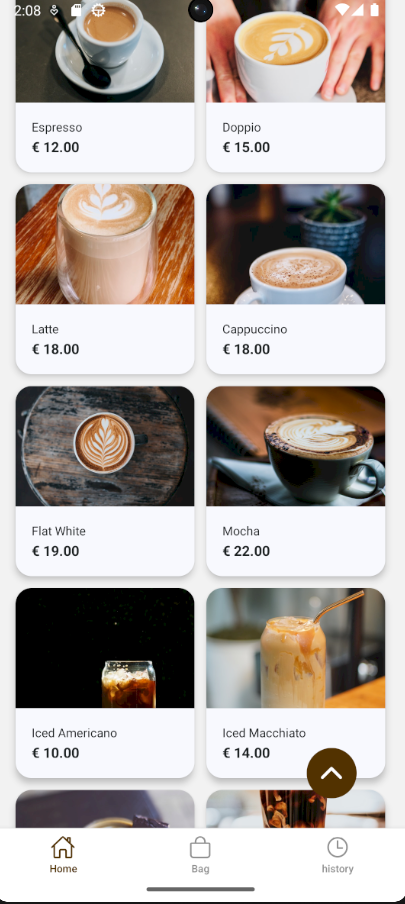
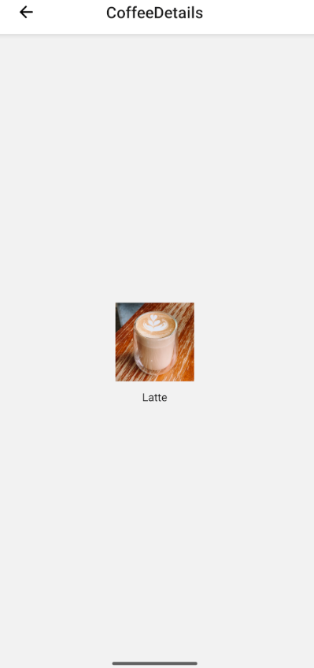

# ☕️ Мобільний Застосунок "CoffeeHouse"

**Короткий опис:** Мобільний застосунок для зручного перегляду меню, формування та керування замовленнями кави та напоїв, а також персоналізації досвіду користувача.

## 🚀 Основний Функціонал (Огляд Впроваджених Модулів)

Цей реліз реалізує базовий цикл взаємодії користувача із застосунком: від перегляду меню до оформлення замовлення та повторних покупок.

### 1. 🏠 Навігація та Вибір (Головна сторінка та Деталі)

* **Головна сторінка:** Центральний екран для швидкого доступу. Включає:
    * **Меню Кави/Напоїв:** Каталог доступних товарів.
    * **Функція Пошуку:** Фільтрація товарів за назвою.
* **Екран Деталей Кави:** Надає повну інформацію про обраний напій та дозволяє налаштувати його (якщо це передбачено) перед додаванням до кошика.
    * **Кнопка "Додати до Кошика"**

### 2. 🛒 Керування Замовленням (Кошик)

* **Екран Кошика:** Місце, де користувач переглядає сформований список покупок.
    * **Додавання/Видалення Товарів:** Користувач може легко змінити кількість товарів або повністю видалити позицію.
    * **Кнопка "Замовити":** Ініціює перехід до процесу оформлення замовлення (Checkout).

### 3. ⏱️ Повторні Покупки (Історія Замовлень)

* **Екран Історії Покупок:** Зберігає записи про всі попередні замовлення користувача.
    * **Функція Повторного Замовлення:** Дозволяє одним натисканням швидко додати всі товари з минулого замовлення знову в кошик, що значно пришвидшує процес для постійних клієнтів.

### 4. ⚙️ Персоналізація (Налаштування)

* **Екран Налаштувань:** Включає опції для індивідуалізації досвіду користувача.
    * **Зміна Теми Застосунку:** Дозволяє користувачу перемикатися між світлою та темною темами (Light/Dark Mode).

---

## 💡 Логіка Прийнятих Рішень (Rationale)

Ці функціональні модулі були обрані для **MVP (Minimum Viable Product - Мінімально Життєздатний Продукт)**, щоб забезпечити базову, але повну функціональність для клієнтів кав'ярні.

| Функціонал | Прийняте Рішення | Перевага / Бізнес-Ціль |
| :--- | :--- | :--- |
| **Пошук та Меню** (Головна) | Реалізовано на першому екрані. | **Швидкість доступу:** Дозволяє користувачу знайти бажаний товар за мінімальну кількість кліків. |
| **Кошик з Редагуванням** | Дозволяє видаляти позиції в кошику. | **Зручність:** Користувач має повний контроль над своїм замовленням перед відправкою, зменшуючи ймовірність помилок. |
| **Історія з Повторним Замовленням** | Реалізовано функцію копіювання минулого замовлення. | **Лояльність та Швидкість:** Створює зручність для постійних клієнтів, стимулюючи повторні продажі ("Recurrent Sales"). |
| **Зміна Теми** (Налаштування) | Включення опції Light/Dark Mode. | **User Experience (UX):** Покращує читабельність та знижує навантаження на очі, особливо вночі, забезпечуючи сучасний стандарт дизайну. |
| **Кнопка "Замовити"** (У кошику) | Чітко відокремлена від процесу *оформлення*. | **Архітектура:** Кнопка слугує переходом до окремого модуля **Checkout** (оформлення замовлення, оплата, вибір адреси/забору), який буде реалізовано в наступних ітераціях. |

---

### ➡️ Наступні Кроки

Плани на майбутні версії включають розробку повного екрану **Оформлення Замовлення (Checkout)** з опціями оплати та вибору доставки/самовивозу, а також впровадження системи автентифікації користувачів.

